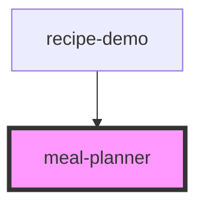

# meal-planner

<!-- Auto Generated Below -->

## Properties

| Property                     | Attribute         | Description                                                               | Type             | Default     |
| ---------------------------- | ----------------- | ------------------------------------------------------------------------- | ---------------- | ----------- |
| `mealPlans`                  | --                | Planned meals.  One recipe per date + mealType.                           | `MealPlanItem[]` | `[]`        |
| `weekStartDate` _(required)_ | `week-start-date` | Any date within the week.  The component automatically calculates Monday. | `string`         | `undefined` |

## Events

| Event          | Description | Type                                                 |
| -------------- | ----------- | ---------------------------------------------------- |
| `addRecipe`    |             | `CustomEvent<{ date: string; mealType: MealType; }>` |
| `clearDay`     |             | `CustomEvent<string>`                                |
| `clearWeek`    |             | `CustomEvent<void>`                                  |
| `deleteRecipe` |             | `CustomEvent<MealPlanItem>`                          |
| `editRecipe`   |             | `CustomEvent<MealPlanItem>`                          |
| `nextWeek`     |             | `CustomEvent<string>`                                |
| `previousWeek` |             | `CustomEvent<string>`                                |
| `todayClicked` |             | `CustomEvent<string>`                                |

## Dependencies

### Used by

 - [recipe-demo](../demo-app)

### Graph

----------------------------------------------

*Built with [StencilJS](https://stenciljs.com/)*
