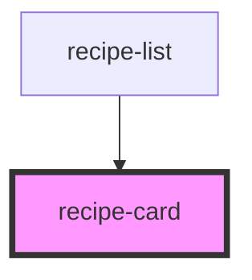

# recipe-card

<!-- Auto Generated Below -->

## Properties

| Property      | Attribute      | Description | Type      | Default     |
| ------------- | -------------- | ----------- | --------- | ----------- |
| `compact`     | `compact`      |             | `boolean` | `false`     |
| `hideActions` | `hide-actions` |             | `boolean` | `false`     |
| `isFavorite`  | `is-favorite`  |             | `boolean` | `false`     |
| `recipe`      | `recipe`       |             | `any`     | `undefined` |

## Events

| Event      | Description | Type                  |
| ---------- | ----------- | --------------------- |
| `delete`   |             | `CustomEvent<string>` |
| `edit`     |             | `CustomEvent<string>` |
| `favorite` |             | `CustomEvent<string>` |
| `open`     |             | `CustomEvent<string>` |

## Dependencies

### Used by

 - [recipe-list](../recipe-list)

### Graph

----------------------------------------------

*Built with [StencilJS](https://stenciljs.com/)*
