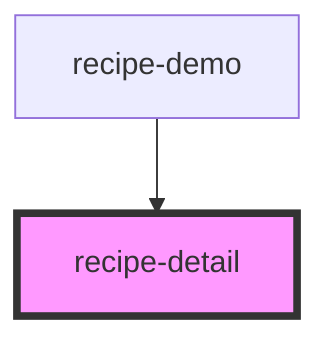

# recipe-detail

<!-- Auto Generated Below -->

## Properties

| Property | Attribute | Description | Type  | Default     |
| -------- | --------- | ----------- | ----- | ----------- |
| `recipe` | `recipe`  |             | `any` | `undefined` |

## Events

| Event    | Description | Type                  |
| -------- | ----------- | --------------------- |
| `edit`   |             | `CustomEvent<string>` |
| `remove` |             | `CustomEvent<string>` |

## Dependencies

### Used by

 - [recipe-demo](../demo-app)

### Graph

----------------------------------------------

*Built with [StencilJS](https://stenciljs.com/)*
