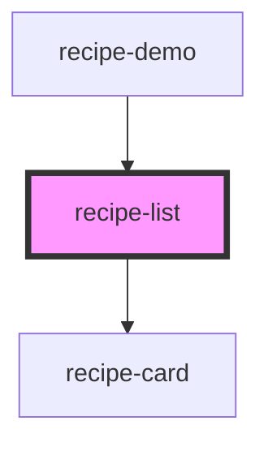

# recipe-list

<!-- Auto Generated Below -->

## Properties

| Property      | Attribute      | Description | Type               | Default  |
| ------------- | -------------- | ----------- | ------------------ | -------- |
| `favoriteIds` | --             |             | `string[]`         | `[]`     |
| `hideActions` | `hide-actions` |             | `boolean`          | `false`  |
| `layout`      | `layout`       |             | `"grid" \| "list"` | `'grid'` |
| `recipes`     | --             |             | `any[]`            | `[]`     |

## Dependencies

### Used by

 - [recipe-demo](../demo-app)

### Depends on

- [recipe-card](../recipe-card)

### Graph

----------------------------------------------

*Built with [StencilJS](https://stenciljs.com/)*
